# Echo AI Orchestrator

> A powerful AI executive assistant that seamlessly integrates filesystem operations, Gmail management, and OpenAI to provide intelligent, multi-step task automation.

[](https://nodejs.org/)
[](https://www.typescriptlang.org/)
[](https://openai.com/)

## 🚀 Features

- **🧠 Intelligent Task Planning**: Uses OpenAI GPT-4 to understand natural language requests and create execution plans
- **📁 Filesystem Operations**: Read, write, and manage local files with context-aware operations
- **📧 Gmail Integration**: Advanced email management with drafting, reading, and quality control
- **🔄 Multi-Step Workflows**: Chains multiple operations together for complex tasks
- **✅ Quality Assurance**: Built-in quality checks for email drafts to ensure professional communication
- **🛡️ RAG (Retrieval-Augmented Generation)**: Retrieves relevant context before generating responses
- **💬 Interactive Chat Interface**: Natural language conversation with the AI assistant

## 🏗️ Architecture

The Echo Orchestrator follows a modular architecture with three main components:

```
┌─────────────────┐    ┌─────────────────┐    ┌─────────────────┐
│                 │    │                 │    │                 │
│  Echo           │    │  Filesystem     │    │  Gmail          │
│  Orchestrator   │◄──►│  Server         │    │  Server         │
│                 │    │                 │    │                 │
└─────────────────┘    └─────────────────┘    └─────────────────┘
         │
         ▼
┌─────────────────┐
│                 │
│  OpenAI API     │
│  (GPT-4)        │
│                 │
└─────────────────┘
```

## 📋 Prerequisites

- **Node.js** 18.0 or higher
- **npm** or **yarn** package manager
- **OpenAI API Key** with GPT-4 access
- **Gmail API credentials** (for email operations)

## 🔧 Installation

1. **Clone the repository**
   ```bash
   git clone https://github.com/yourusername/echo-orchestrator.git
   cd echo-orchestrator
   ```

2. **Install dependencies**
   ```bash
   npm install
   ```

3. **Build the project**
   ```bash
   npm run build
   ```

4. **Set up Google Gmail API credentials**
   
   a. **Download credentials from Google Cloud Console**
   - Go to [Google Cloud Console](https://console.cloud.google.com/)
   - Create a new project or select an existing one
   - Enable the Gmail API
   - Create credentials (OAuth 2.0 Client ID) for a desktop application
   - Download the credentials file and save it as `credentials.json` in the root directory
   
   b. **Generate authentication token**
   ```bash
   npm run auth
   ```
   This will:
   - Open your web browser
   - Ask you to log in to your Google account
   - Request permission to access your Gmail
   - Generate a `token.json` file automatically
   
   c. **Set up environment variables**
   Create a `.env` file in the root directory:
   ```env
   OPENAI_API_KEY=your_openai_api_key_here
   ```

5. **Create workspace directory**
   ```bash
   mkdir echo-workspace
   ```

## 🔑 Authentication Setup

### Gmail API Authentication

Echo uses OAuth 2.0 for secure Gmail access. You'll need to complete a one-time authentication setup:

1. **Get Google Cloud Console credentials**
   - Visit [Google Cloud Console](https://console.cloud.google.com/)
   - Create a new project or select existing
   - Enable the Gmail API for your project
   - Create OAuth 2.0 credentials (Desktop Application type)
   - Download as `credentials.json` and place in project root

2. **Run the authentication script**
   ```bash
   node src/auth.js
   ```
   Or if you have it in package.json:
   ```bash
   npm run auth
   ```

3. **Complete the OAuth flow**
   - Your browser will open automatically
   - Log in to your Google account
   - Grant permissions for Gmail access
   - The script will generate `token.json` automatically

4. **Verify authentication**
   You should see:
   ```
   ✅ Token saved successfully to /path/to/token.json
   You can now start the main gmail-server.js application.
   ```

> **Note**: You only need to run the authentication once. The `token.json` file will be used for all subsequent Gmail operations.

## 🚀 Quick Start

1. **Start the orchestrator**
   ```bash
   npm start
   ```

2. **Try some example commands**
   ```
   > What tools can you use?
   > Find my latest unread email and save it to latest.txt
   > Draft a reply to John about the project status
   > Create a summary of all files in my workspace
   ```

3. **Exit the application**
   ```
   > quit
   ```

## 🔄 Core Workflows

### RAG & Quality Check Email Drafting

This is the most sophisticated workflow in Echo, ensuring high-quality email responses through a multi-step process:

```mermaid
sequenceDiagram
    actor User
    participant Orchestrator as 🤖 Echo Orchestrator
    participant OpenAI as 🧠 OpenAI API
    participant GmailServer as ✉️ Gmail Server
    
    %% --- Step 1: User's Request ---
    User->>+Orchestrator: "Draft a reply to Jane Doe about Project Phoenix..."

    %% --- Step 2: The Planning Phase ---
    Orchestrator->>+OpenAI: Create a plan based on my system prompt and this request.
    Note over Orchestrator, OpenAI: System prompt includes RAG & Quality Check rules.
    OpenAI-->>-Orchestrator: Plan: [list_emails, read_email, quality_check, create_draft]

    %% --- Step 3: Execution - RAG Retrieval ---
    Orchestrator->>+GmailServer: callTool: list_emails(query='from:Jane Doe...')
    Note right of Orchestrator: Step 1 of RAG: Find the email.
    GmailServer-->>-Orchestrator: return: { content: "ID: 18f..." }

    Orchestrator->>+GmailServer: callTool: read_email(message_id='18f...')
    Note right of Orchestrator: Step 2 of RAG: Read the content.
    GmailServer-->>-Orchestrator: return: { content: "Hi, just checking in..." }

    %% --- Step 4: Execution - Internal Generation & Quality Check ---
    Orchestrator->>Orchestrator: Internally formulates the draft reply text.
    Note over Orchestrator: "Hi Jane, I'm on it. Will send an update by EOD..."

    Orchestrator->>+GmailServer: callTool: quality_check(text='Hi Jane, I'm on it...')
    Note right of Orchestrator: Step 3: The mandatory safety check.
    
    %% --- The Server-Side Sampling Sub-Flow ---
    GmailServer->>+OpenAI: Sample: Is this text polite and professional?
    Note over GmailServer, OpenAI: This is the server's own LLM call (Sampling).
    OpenAI-->>-GmailServer: return: "OK"
    
    GmailServer-->>-Orchestrator: return: { content: "OK" }

    %% --- Step 5: Execution - Final Action ---
    Orchestrator->>+GmailServer: callTool: create_draft(to='jane.doe...', body='...')
    Note right of Orchestrator: Step 4: Quality check passed, now save the draft.
    GmailServer-->>-Orchestrator: return: { content: "Draft created with ID: r-456..." }

    %% --- Step 6: Final Confirmation ---
    Orchestrator->>+OpenAI: All tools executed. Please summarize the final result for the user.
    OpenAI-->>-Orchestrator: return: "I have drafted a high-quality reply..."
    
    Orchestrator-->>-User: ✅ Echo says: I have drafted a high-quality reply to Jane Doe... The draft is saved in your Gmail.
```



### Workflow Steps Explained

1. **User Request**: Natural language command to draft an email reply
2. **Planning Phase**: OpenAI generates a step-by-step execution plan
3. **RAG Retrieval**: 
   - Find the original email thread
   - Read the full email content for context
4. **Quality Check**: 
   - Orchestrator formulates draft internally
   - Mandatory quality check via Gmail server
   - Server-side LLM validation for professionalism
5. **Final Action**: Create the draft only if quality check passes
6. **Confirmation**: Summarize results for the user

## 🛠️ Available Tools

### Filesystem Tools
- `read_file` - Read contents of a file
- `write_file` - Write content to a file
- `list_files` - List files in a directory
- `delete_file` - Delete a file
- `create_directory` - Create a new directory

### Gmail Tools
- `list_emails` - Search and list emails
- `read_email` - Read full email content
- `send_email` - Send a new email
- `create_draft` - Create an email draft
- `quality_check` - Validate email content quality

## 📝 Usage Examples

### Basic File Operations
```
> Create a file called notes.txt with the content "Meeting notes from today"
> Read the contents of notes.txt
> List all files in my workspace
```

### Email Management
```
> Show me my latest 5 unread emails
> Read the email from john@company.com about the project
> Draft a reply to Sarah thanking her for the proposal
```

### Complex Multi-Step Tasks
```
> Find the latest email from my manager, save it to a file, and draft a response
> Create a summary of all my emails from last week and save it to weekly-summary.txt
> Read all .txt files in my workspace and create a consolidated report
```

## 🔧 Configuration

### Environment Variables

| Variable | Description | Required |
|----------|-------------|----------|
| `OPENAI_API_KEY` | Your OpenAI API key | Yes |

### Required Files

| File | Description | How to Get |
|------|-------------|------------|
| `credentials.json` | Google Cloud OAuth 2.0 credentials | Download from Google Cloud Console |
| `token.json` | User authentication token | Auto-generated by running `node src/auth.js` |
| `.env` | Environment variables | Create manually with your OpenAI API key |

### Project Structure
```
echo-orchestrator/
├── src/
│   ├── orchestrator.ts          # Main orchestrator class
│   ├── filesystem-server.ts     # Filesystem operations server
│   └── gmail-server.ts          # Gmail operations server
├── build/                       # Compiled JavaScript files
├── echo-workspace/              # Default workspace directory
├── .env                         # Environment variables
├── package.json
└── README.md
```

## 🔒 Security Features

- **Quality Control**: All email drafts undergo mandatory quality checks
- **Environment Isolation**: Filesystem operations are restricted to the workspace
- **API Key Protection**: Secure handling of OpenAI and Gmail credentials
- **Error Handling**: Comprehensive error handling and logging

## 🧪 Development

### Running in Development Mode
```bash
npm run dev
```

### Building the Project
```bash
npm run build
```

### Running Tests
```bash
npm test
```

## 🤝 Contributing

1. Fork the repository
2. Create a feature branch (`git checkout -b feature/amazing-feature`)
3. Commit your changes (`git commit -m 'Add amazing feature'`)
4. Push to the branch (`git push origin feature/amazing-feature`)
5. Open a Pull Request
